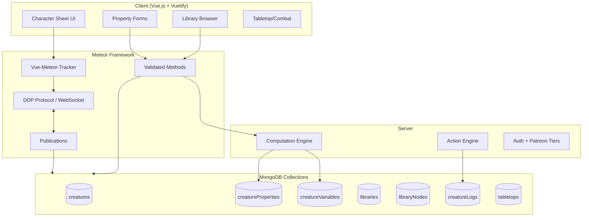
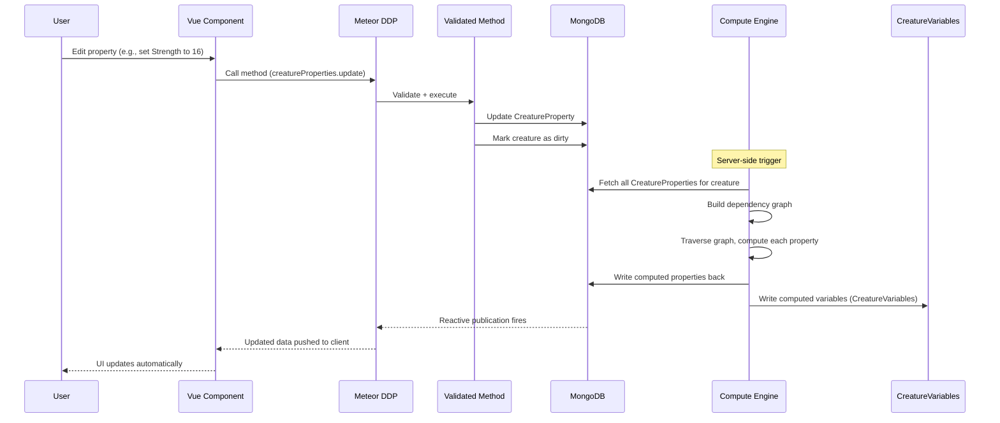
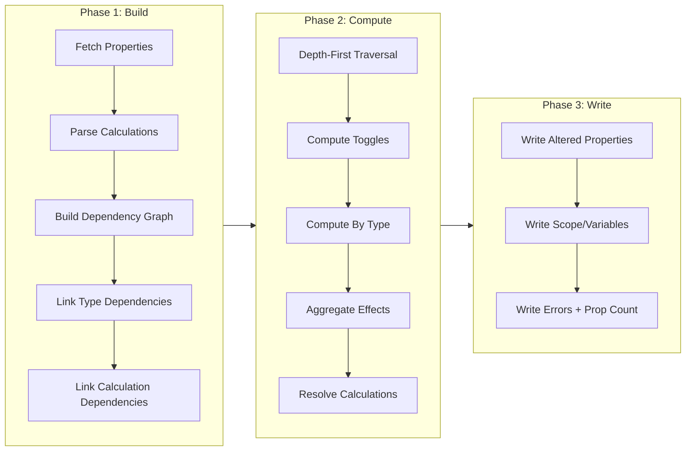
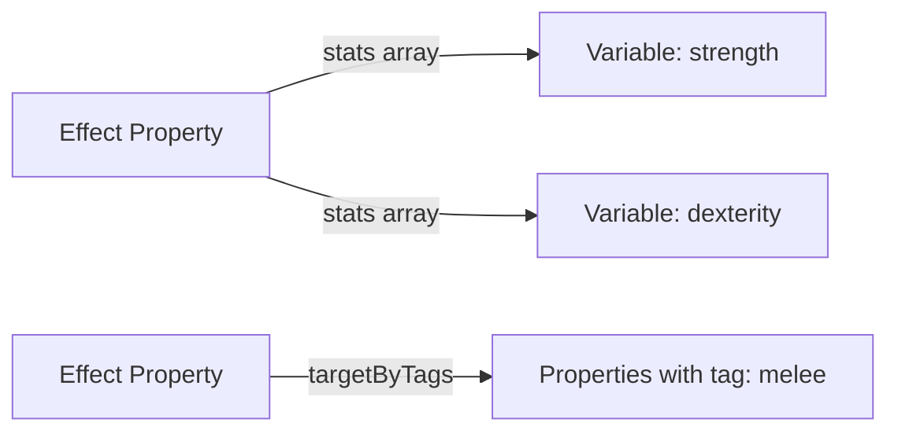
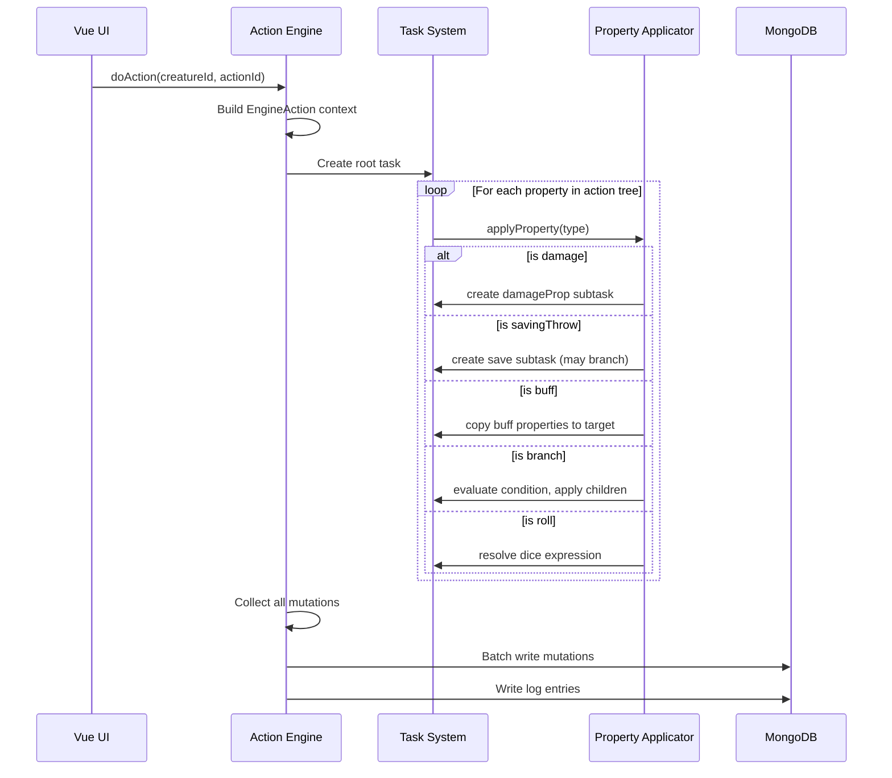

# DiceCloud Architecture

## System Architecture Overview



---

## Data Flow: User Input to Final Stats



---

## The Property Tree

DiceCloud stores all character data as a tree of typed properties. Every ability score, skill, spell, item, buff, and feature is a node in this tree.

### Tree Structure

```
Creature (root)
├── Ruleset Slot [propertySlot, tag: "base"]
│   └── (filled from library: D&D 5e SRD)
│       ├── Strength [attribute, ability]
│       ├── Dexterity [attribute, ability]
│       ├── ... (other ability scores)
│       ├── Proficiency Bonus [attribute, stat]
│       ├── Armor Class [attribute, stat]
│       ├── Hit Points [attribute, healthBar]
│       ├── Acrobatics [skill, skillType: skill]
│       ├── Athletics [skill, skillType: skill]
│       ├── ... (other skills)
│       ├── Strength Save [skill, skillType: save]
│       └── ... (other saves)
├── Inventory [folder]
│   ├── Equipment [container]
│   │   └── Longsword [item]
│   │       └── Attack [action]
│   │           ├── To Hit [roll]
│   │           └── Damage [damage]
│   └── Carried [container]
├── Fighter [class]
│   ├── Level 1 [classLevel]
│   │   ├── Fighting Style Slot [propertySlot]
│   │   ├── Second Wind [action]
│   │   └── Hit Dice [attribute, hitDice]
│   └── Level 2 [classLevel]
│       └── Action Surge [action]
└── Buff: Bless [buff]
    └── Effect: +1d4 to attacks [effect]
```

### Nested Set Model

The tree uses a "nested set" model with `left` and `right` integer fields on each node for efficient ancestor/descendant queries:

```
1 Creature 30
├── 2 Strength 3
├── 4 Fighter 15
│   ├── 5 Level 1 10
│   │   ├── 6 Second Wind 7
│   │   └── 8 Hit Dice 9
│   └── 11 Level 2 14
│       └── 12 Action Surge 13
└── 16 Inventory 29
    └── 17 Equipment 28
        └── 18 Longsword 27
```

**Query patterns:**
- Descendants of Fighter: `left > 4 AND right < 15`
- Ancestors of Hit Dice: `left < 8 AND right > 9`
- All root-level properties: `root.id = creatureId`

---

## Computation Engine

### Three-Phase Pipeline



### Phase 1: Build (`buildCreatureComputation.ts`)

1. **Fetch all CreatureProperties** for the creature from MongoDB
2. **Create CreatureComputation** instance with dependency graph (ngraph.graph)
3. **Parse all calculation fields** using Nearley.js grammar into AST parse trees
4. **Establish tree structure** using nested set properties (left/right)
5. **Walk the tree** to compute inactive status and toggle dependencies
6. **Link type-specific dependencies** -- each property type registers its deps:
   - Attributes: base value calculation, variable name
   - Skills: ability score, proficiency bonus, base value
   - Effects: amount calculation, target stats/tags
   - Actions: attack roll, uses, item/attribute resources

### Phase 2: Compute (`computeCreatureComputation.ts`)

Uses **depth-first traversal with cycle detection**:

```
for each node in reverse tree order:
  1. Mark node as "visiting children"
  2. Push all dependencies onto stack
  3. When revisited (children done): compute this node
  4. Mark as visited
```

**Compute dispatch by type:**

| Type | Handler | What It Does |
|------|---------|--------------|
| `_variable` | `computeVariable` | Aggregates definitions, effects, proficiencies into final value |
| `_calculation` | `computeCalculation` | Evaluates formula, applies effects/proficiencies |
| `attribute` | `computeAttribute` | Computes base value, total, value after damage |
| `skill` | `computeSkill` | Computes skill modifier (ability + proficiency + effects) |
| `action` | `computeAction` | Resolves attack rolls, available uses, resources |
| `spellList` | `computeSpellList` | Resolves spellcasting ability modifier |
| `toggle` | computed via `computeToggles` | Evaluates condition, activates/deactivates descendants |

### Phase 3: Write

1. **Compare** computed properties against originals (via EJSON deep equality)
2. **Batch update** only changed properties back to MongoDB
3. **Write scope** (computed variable values) to `creatureVariables` collection
4. **Write errors** and property count to the creature document

---

## Effect / Modifier System

Effects are the core mechanism for modifying stats. An effect targets one or more variables and applies an operation.

### Effect Targeting



Two targeting modes:
1. **By variable name:** `stats: ['strength', 'dexterity']`
2. **By tags:** `targetByTags: true, targetTags: ['melee']` (with optional `extraTags` for OR/NOT)

### Effect Operations

| Operation | Behavior | Example |
|-----------|----------|---------|
| `base` | Sets base value (max of all bases) | AC base = 10 |
| `add` | Adds to total (all adds summed) | +2 from magic item |
| `mul` | Multiplies total (all muls multiplied) | x2 critical damage |
| `min` | Sets minimum floor (max of all mins) | Min HP = 1 |
| `max` | Sets maximum ceiling (min of all maxes) | Max speed = 0 |
| `set` | Overrides final value (highest wins) | Set AC = 20 |
| `advantage` | Grants advantage (counted) | Advantage on Stealth |
| `disadvantage` | Grants disadvantage (counted) | Disadvantage on attacks |
| `passiveAdd` | Adds to passive score only | +5 passive Perception |
| `fail` | Forces automatic failure (counted) | Auto-fail Str saves |
| `conditional` | Adds conditional text | "+1d4 vs. undead" |

### Aggregation Order

```
base     = max(all base effects, stat definition)
result   = (base + sum(all adds)) * product(all muls)
result   = max(result, highest min)
result   = min(result, lowest max)
result   = set value (if any set effect exists, highest wins)
result   = floor(result) (unless decimal attribute)
```

---

## Expression Parser

DiceCloud includes a custom expression parser built on Nearley.js and Moo.js for tokenization.

### Parse Pipeline

```
"1d8 + strength.modifier + 2"
    ↓ (Moo.js Lexer)
[DICE:1d8, OP:+, IDENT:strength, DOT:., IDENT:modifier, OP:+, NUMBER:2]
    ↓ (Nearley.js Grammar)
{parseType: 'operator', operator: '+', left: {
  parseType: 'operator', operator: '+', left: {
    parseType: 'roll', number: 1, diceSize: 8
  }, right: {
    parseType: 'accessor', name: 'strength', path: ['modifier']
  }
}, right: {
  parseType: 'constant', value: 2
}}
    ↓ (resolve with scope)
Final value (e.g., 12)
```

### Resolution Levels

| Level | Purpose | Used When |
|-------|---------|-----------|
| `compile` | Variable substitution only | Building dependency graph |
| `reduce` | Evaluate to constants | Computing stat values |
| `roll` | Execute dice rolls | Action execution |

### Supported Operations

- Arithmetic: `+`, `-`, `*`, `/`, `%`, `^`
- Comparison: `>`, `<`, `>=`, `<=`, `==`, `!=`
- Logic: `&&`, `||`, `!`
- Ternary: `condition ? a : b`
- Functions: `floor()`, `ceil()`, `round()`, `min()`, `max()`, `abs()`, `sqrt()`
- Dice: `1d20`, `2d6`, `4d6kh3` (keep highest 3)
- Property access: `strength.modifier`, `level`

---

## Library System

```mermaid
graph TB
    subgraph Market ["Library Market"]
        LC[Library Collection<br>"5e SRD Complete"]
        L1[Library: "SRD Classes"]
        L2[Library: "SRD Spells"]
        L3[Library: "SRD Races"]
    end

    subgraph Library ["Library: SRD Classes"]
        N1[Fighter Class]
        N2[Level 1 ClassLevel]
        N3[Fighting Style Slot]
        N4[Second Wind Action]
        N5[Level 2 ClassLevel]
        N6[Action Surge Action]
    end

    subgraph Character ["Character"]
        S[Ruleset Slot<br>tag: base]
        C[Fighter Copy]
    end

    LC --> L1
    LC --> L2
    LC --> L3
    N1 --> N2
    N1 --> N5
    N2 --> N3
    N2 --> N4
    N5 --> N6

    L1 -.->|"fill slot / import"| S
    N1 -.->|"deep clone"| C
```

### How Libraries Work

1. **Library** = a named collection of property templates (LibraryNodes)
2. **LibraryNode** = a property template with the same type system as CreatureProperties
3. **LibraryCollection** = a bundle of related libraries
4. **Import flow:**
   - User opens "Fill Slot" or "Insert from Library" dialog
   - Selects a LibraryNode matching slot tags or search criteria
   - System deep-clones the node and all descendants
   - Cloned nodes are inserted as CreatureProperties with new IDs
   - `libraryNodeId` field preserves the source reference

### The Ruleset Pattern

New characters are created with a "Ruleset" slot:
```javascript
{
  type: 'propertySlot',
  name: 'Ruleset',
  slotTags: ['base'],
  quantityExpected: { calculation: '1' },
  hideWhenFull: true,
}
```

A D&D 5e base ruleset library would fill this slot with all ability scores, skills, saves, proficiency bonus, and other foundational properties. This is the primary mechanism for multi-system support -- each game system provides its own base ruleset library.

---

## MongoDB Collections

| Collection | File | Purpose |
|------------|------|---------|
| `creatures` | `api/creature/creatures/Creatures.ts` | Characters/NPCs/Monsters |
| `creatureProperties` | `api/creature/creatureProperties/CreatureProperties.ts` | All property nodes (polymorphic) |
| `creatureVariables` | `api/creature/creatures/CreatureVariables.ts` | Computed variable scope |
| `creatureFolders` | `api/creature/creatureFolders/CreatureFolders.js` | UI folder organization |
| `creatureLogs` | `api/creature/log/CreatureLogs.ts` | Action history/audit trail |
| `experiences` | `api/creature/experience/Experiences.js` | XP and milestone tracking |
| `libraries` | `api/library/Libraries.js` | Shared property template collections |
| `libraryNodes` | `api/library/LibraryNodes.ts` | Property templates in libraries |
| `libraryCollections` | `api/library/LibraryCollections.js` | Bundles of libraries |
| `tabletops` | `api/tabletop/Tabletops.ts` | Multiplayer game sessions |
| `tabletopObjects` | `api/tabletop/TabletopObjects.js` | Battle map tokens |
| `tabletopMaps` | `api/tabletop/TabletopMaps.ts` | Battle maps |
| `messages` | `api/tabletop/Messages.js` | In-session chat |
| `invites` | `api/users/Invites.js` | Patreon invite system |
| `users` | `api/users/Users.js` (extends Meteor.users) | User accounts |

---

## Action Execution Engine

When a player uses an ability, casts a spell, or performs an action:



### Task Types

- `doActionProperty` -- Execute an action property and its children
- `damageProp` -- Apply damage/healing to an attribute
- `consumeItemAsAmmo` -- Reduce item quantity
- `check` -- Roll a skill check
- `castSpell` -- Cast a spell (spending slots)
- `rest` -- Short/long rest (reset resources, recover hit dice)

---

## Authentication & Permissions

### Sharing Model

Every document (creature, library, tabletop) extends `SharingSchema`:

```typescript
{
  owner: String,           // Full control
  writers: String[],       // Can edit
  readers: String[],       // Can view
  public: Boolean,         // Everyone can view
  readersCanCopy: Boolean, // Readers can clone
}
```

### Patreon Tiers

Users have tiers that gate features:
- **Free tier:** Limited character slots
- **Paid tiers:** More characters, library creation, file storage
- **Invite system:** Supporters can gift character slots

---

## Tech Stack

| Layer | Technology |
|-------|-----------|
| Framework | Meteor.js 2.x |
| Database | MongoDB |
| Client UI | Vue.js 2 + Vuetify 2 |
| Reactivity | Vue-Meteor-Tracker |
| State Management | Vuex |
| Routing | Vue Router |
| Schema Validation | simpl-schema |
| Expression Parser | Nearley.js + Moo.js |
| Dependency Graph | ngraph.graph |
| Path Finding | ngraph.path (for cycle detection) |
| File Storage | S3 (via Slingshot) |
| Deployment | Docker Compose |
